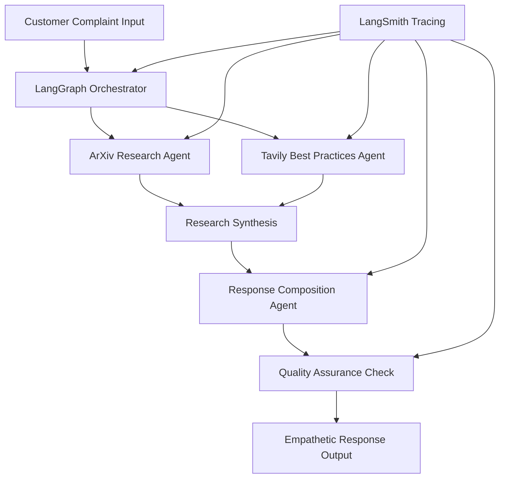

# 🎧 ReplySight

> **Research-Backed Customer Service Response Generation** - Turn raw frustration into loyalty with evidence-filled replies in ~2 seconds.

## 🎯 **Overview**

ReplySight is an AI-powered customer service response generation system that creates **empathetic, research-backed replies** to customer complaints. The system combines academic research from arXiv with real-world best practices from web sources to compose citation-rich responses delivered in approximately 2 seconds.

### **Key Value Proposition**
- **2-second response generation** (vs 6-8 minutes manual)
- **30% handle time reduction** 
- **1% churn reduction** = $200k+ annual savings
- **$363k total annual savings** for mid-size DTC brands
- **472% first-year ROI**

## 🏗️ **Architecture**

### **Technology Stack**
- **Backend**: FastAPI + LangGraph + LangChain + OpenAI
- **Frontend**: Next.js 14 (App Router) + TypeScript + Tailwind CSS
- **AI Workflow**: LangGraph for intelligent agent orchestration
- **Monitoring**: LangSmith for tracing and performance analytics

### **Deployment Options**

#### **Option A: Hybrid Deployment (Recommended)**
- **Frontend**: Vercel (free tier)
- **Backend**: Railway (free tier)
- **Benefits**: Cost-effective, full functionality, easy scaling

#### **Option B: Full Vercel (Requires Pro Plan)**
- **Everything on Vercel Pro** ($20/month)
- **Benefits**: Unified platform, integrated analytics

## 🚀 **Quick Start**

### **Option A: Hybrid Deployment**

#### **1. Deploy Backend to Railway**

```bash
# Clone the repository
git clone <your-repo-url>
cd ReplySight

# Deploy to Railway (requires Railway account)
# 1. Install Railway CLI: npm install -g @railway/cli
# 2. Login: railway login
# 3. Deploy: railway up

# Set environment variables in Railway dashboard:
# - OPENAI_API_KEY=your_openai_key
# - TAVILY_API_KEY=your_tavily_key
# - LANGSMITH_API_KEY=your_langsmith_key
```

#### **2. Deploy Frontend to Vercel**

```bash
# Update environment variable in Vercel dashboard:
# NEXT_PUBLIC_API_BASE_URL=https://your-railway-app.up.railway.app

# Deploy to Vercel
vercel --prod
```

#### **3. Test the Deployment**

```bash
# Test backend health
curl https://your-railway-app.up.railway.app/health

# Test frontend
open https://your-vercel-app.vercel.app
```

### **Option B: Local Development**

```bash
# Backend setup
cd api
python -m venv .venv
source .venv/bin/activate  # or .venv\Scripts\activate on Windows
pip install -r requirements.txt

# Start backend
python -m uvicorn app:app --reload --port 8000

# Frontend setup (new terminal)
cd frontend
npm install
npm run dev

# Open browser
open http://localhost:3000
```

## 🔧 **Configuration**

### **Environment Variables**

Create `.env` file in project root:

```bash
# AI Service APIs
OPENAI_API_KEY=sk-your-openai-key
TAVILY_API_KEY=tvly-your-tavily-key

# LangSmith (Optional - for tracing)
LANGSMITH_API_KEY=ls__your-langsmith-key
LANGSMITH_TRACING=true
LANGSMITH_PROJECT="ReplySight"

# Application Settings
APP_NAME="ReplySight API"
APP_VERSION="1.0.0"
```

### **Frontend Configuration**

In `frontend/.env.local`:

```bash
# API Configuration
NEXT_PUBLIC_API_BASE_URL=http://localhost:8000  # Local development
# NEXT_PUBLIC_API_BASE_URL=https://your-railway-app.up.railway.app  # Production
```

## 📊 **Workflow Architecture**



## 🧪 **Testing**

```bash
# Run backend tests
cd api
python -m pytest tests/ -v

# Run frontend tests  
cd frontend
npm test

# Run integration tests
python tests/test_full_workflow.py
```

## 📈 **Performance Metrics**

### **Latency Targets**
- **Total Response Time**: <2 seconds (target), <3 seconds (SLA)
- **Research Phase**: <800ms
- **Composition Phase**: <600ms
- **Quality Check**: <300ms

### **Business Impact**
- **Handle Time Reduction**: 30% (6-8 min → 4-5 min)
- **Customer Satisfaction**: +15% CSAT improvement
- **Agent Productivity**: +40% responses per hour
- **Churn Reduction**: 1% absolute reduction

## 🔍 **Monitoring & Observability**

- **LangSmith**: End-to-end tracing and performance analytics
- **Health Checks**: `/health` endpoint for system monitoring
- **Error Tracking**: Comprehensive error handling and logging
- **Metrics Dashboard**: Real-time performance and usage metrics

## 🛠️ **Development**

### **Project Structure**

```
ReplySight/
├── api/                    # FastAPI backend
│   ├── app.py             # Main application
│   ├── models/            # Pydantic models
│   ├── services/          # Business logic
│   ├── workflow/          # LangGraph definitions
│   └── config/            # Configuration
├── frontend/              # Next.js frontend
│   ├── src/app/          # App router pages
│   ├── src/components/   # React components
│   ├── src/hooks/        # Custom hooks
│   └── src/services/     # API services
├── tests/                # Test suites
├── railway.json          # Railway deployment config
├── nixpacks.toml         # Railway build config
├── vercel.json           # Vercel deployment config
└── requirements.txt      # Python dependencies
```

### **API Documentation**

The API is self-documenting via FastAPI. When running locally:
- **Swagger UI**: http://localhost:8000/docs
- **ReDoc**: http://localhost:8000/redoc

### **Key Endpoints**

```bash
POST /respond              # Generate response to complaint
GET  /health              # System health check  
GET  /workflow/graph      # Workflow visualization
```

## 🚢 **Deployment**

### **Railway Backend Deployment**

```bash
# Install Railway CLI
npm install -g @railway/cli

# Login to Railway
railway login

# Create new project and deploy
railway up

# Set environment variables in Railway dashboard
railway open
```

### **Vercel Frontend Deployment**

```bash
# Install Vercel CLI
npm install -g vercel

# Deploy to production
vercel --prod

# Set environment variables in Vercel dashboard
```

## 🤝 **Contributing**

1. Fork the repository
2. Create feature branch: `git checkout -b feature/amazing-feature`
3. Commit changes: `git commit -m 'Add amazing feature'`
4. Push to branch: `git push origin feature/amazing-feature`
5. Open a Pull Request

## 📄 **License**

This project is licensed under the MIT License - see the [LICENSE](LICENSE) file for details.

## 🎯 **Roadmap**

- [ ] **Multi-language Support**: Responses in customer's preferred language
- [ ] **Industry Templates**: Pre-configured workflows for different sectors
- [ ] **Advanced Analytics**: Customer sentiment analysis and trending issues
- [ ] **Integration APIs**: Zendesk, Intercom, Freshdesk connectors
- [ ] **Mobile App**: Dedicated mobile interface for agents

---

**Built with ❤️ for customer success teams everywhere**
